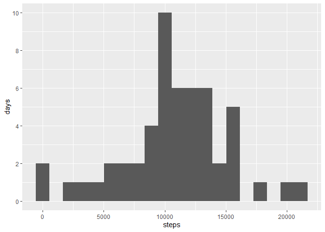
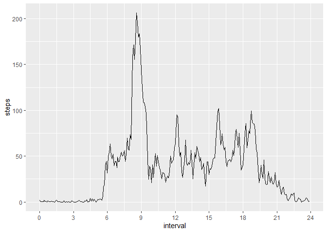
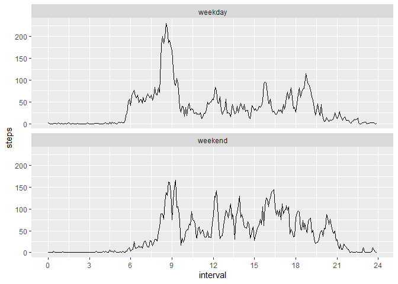

## Loading and preprocessing the data

The intervals are provided in HHMM format.
These are extracted and reformated as hours.


```r
activity_data <- read_csv("activity.csv",
                          col_types = c("dDc")) %>%
  mutate(interval = str_pad(interval,
                            width = 4,
                            side = "left",
                            pad = "0")) %>%
  extract(interval,
          into = c("hr", "min"),
          regex = "(\\d{2})(\\d{2})",
          convert = TRUE) %>%
  mutate(interval = hr + (min / 60))

head(activity_data, 10)
```

```
## # A tibble: 10 x 5
##    steps date          hr   min interval
##    <dbl> <date>     <int> <int>    <dbl>
##  1    NA 2012-10-01     0     0   0     
##  2    NA 2012-10-01     0     5   0.0833
##  3    NA 2012-10-01     0    10   0.167 
##  4    NA 2012-10-01     0    15   0.25  
##  5    NA 2012-10-01     0    20   0.333 
##  6    NA 2012-10-01     0    25   0.417 
##  7    NA 2012-10-01     0    30   0.5   
##  8    NA 2012-10-01     0    35   0.583 
##  9    NA 2012-10-01     0    40   0.667 
## 10    NA 2012-10-01     0    45   0.75
```


## What is mean total number of steps taken per day?


```r
daily_data <- activity_data %>%
  drop_na() %>%
  group_by(date) %>%
  summarize(steps = sum(steps))

ggplot(data = daily_data,
       aes(x = steps)) +
  geom_histogram(bins = 20) +
  ylab("days") +
  scale_y_continuous(breaks = seq(0, 12, by = 2))
```

<!-- -->

```r
daily_mean <- mean(daily_data$steps)
print(paste("Mean is",
            daily_mean))
```

```
## [1] "Mean is 10766.1886792453"
```

```r
daily_median <- median(daily_data$steps)
print(paste("Median is",
            daily_median))
```

```
## [1] "Median is 10765"
```

## What is the average daily activity pattern?


```r
daily_pattern <- activity_data %>%
  drop_na() %>%
  group_by(interval) %>%
  summarize(steps = mean(steps))

ggplot(data = daily_pattern) +
  geom_line(aes(x = interval,
                y = steps)) +
  scale_x_continuous(breaks = seq(0, 24, by = 3))
```

<!-- -->

```r
max_interval <- daily_pattern %>%
  filter(steps == max(daily_pattern$steps)) %>%
  pull(interval)

# converting the hours back to HH:MM
max_int_hr <- floor(max_interval)
max_int_min <- 60 * (max_interval - max_int_hr)
max_int_str <- paste(max_int_hr,
                     max_int_min,
                     sep = ":")

print(paste("Maximum step interval is",
            max_int_str))
```

```
## [1] "Maximum step interval is 8:35"
```

## Imputing missing values


```r
na_count <- activity_data %>%
  filter(is.na(steps)) %>%
  nrow() %>%
  as.numeric()
print(paste("Number of NA rows is",
            na_count))
```

```
## [1] "Number of NA rows is 2304"
```

```r
activity_clean <- activity_data %>%
  left_join(daily_pattern,
            by = "interval") %>%
  mutate(steps = coalesce(steps.x, steps.y)) %>%
  select(steps, date, interval)
```

## Are there differences in activity patterns between weekdays and weekends?


```r
weekend_data <- activity_clean %>%
  mutate(day_of_week = weekdays(date)) %>%
  mutate(weekend = as.factor(if_else(day_of_week == "Saturday" |
                                       day_of_week == "Sunday",
                                     "weekend",
                                     "weekday"))) %>%
  group_by(weekend, interval) %>%
  summarize(steps = mean(steps))

ggplot(data = weekend_data) +
  geom_line(aes(x = interval,
                y = steps,
                color = weekend)) +
  scale_x_continuous(breaks = seq(0, 24, by = 3))
```

<!-- -->
